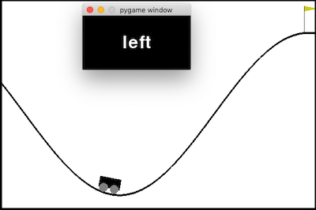

# TAMER
TAMER (Training an Agent Manually via Evaluative Reinforcement) is a framework for human-in-the-loop Reinforcement Learning, proposed by [Knox + Stone](http://www.cs.utexas.edu/~sniekum/classes/RLFD-F16/papers/Knox09.pdf) in 2009. 

This is an implementation of a TAMER agent, converted from a standard Q-learning agent using the steps provided by Knox [here](http://www.cs.utexas.edu/users/bradknox/kcap09/Knox_and_Stone,_K-CAP_2009.html). We added two optional modality, gesture and sound, and an instrcution method to the projet https://github.com/benibienz/TAMER.

## How to run
You need python 3.7+ with numpy, sklearn, pygame and gym.

Install the packages and libraries by running the following lines:

python3 -m pip install -r requirements.txt

Use run.py. You can fiddle with the config in the script.

We offer four different modes, which you can modify in the run.py 

mode0: clavier, mode1: gest, mode2: parole, mode3: instruction

In training mode 0, watch the agent play and press 'W' to give a positive reward and 'A' to give a negative. The agent's current action is displayed.

In training mode 1, watch the agent play and show a gesture near the thumb and index finger to give a positive reward and a gesture away from the thumb and index finger to give a negative. The agent's current action is displayed.

In training mode 2, watch the agent play and say 'yes' to give a positive reward and say 'no' to give a negative. The agent's current action is displayed.

In training mode 3, watch the agent and give instructions on what to do next. press 'r' go right, press 'l' go left, press 's' stop.

